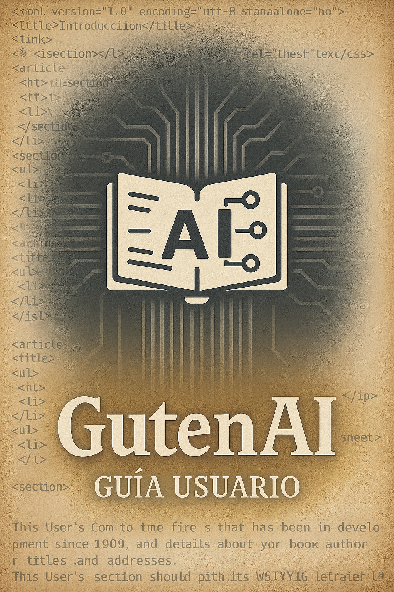

# Documentación de GutenAI

Bienvenido a la documentación central de GutenAI. Aquí encontrarás recursos pensados para usuarios finales y colaboradores técnicos. Usa el índice para navegar:

- [Guía de Usuario](usuario/instalacion.md): primeros pasos, flujo de trabajo y resolución de problemas.
- [Referencia Técnica](referencia/manual.md): comandos, dependencias y módulos clave para desarrollo.
- [Descripción de Arquitectura](arquitectura/overview.md): diseño de alto nivel, componentes y decisiones.

Las capturas de pantalla y diagramas residen en `assets/<sección>/`. Al agregar nuevos recursos visuales, guarda los archivos ahí y enlázalos con rutas relativas (por ejemplo, ``).
