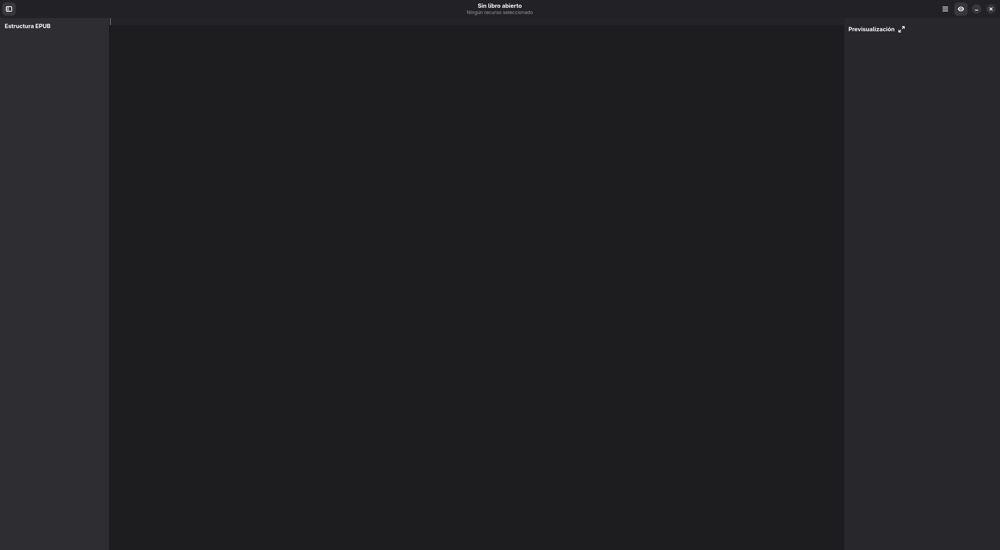

# Guía de Usuario de GutenAI

## ¿Qué es GutenAI?
GutenAI es un editor modular de libros EPUB con interfaz GTK4/libadwaita. Permite abrir, modificar y exportar libros digitales con herramientas visuales y soporte para HTML, CSS e imágenes.

## Requisitos previos
- **Sistema**: Linux con GTK4, libadwaita y WebKit instalados (`python-gobject`, `libadwaita-1`, `libwebkit2gtk-4.0`).
- **Python**: versión 3.10+ con `pip`.
- **Dependencias**: instala `pip install -r requirements.txt` dentro de un entorno virtual (`python -m venv .venv && source .venv/bin/activate`).
- **Material de prueba**: la carpeta `libros/` incluye EPUBs de demostración.

## Instalación y primer arranque
1. Clona el repositorio y entra a la raíz.
2. Crea/activa el entorno virtual y ejecuta `pip install -r requirements.txt`.
3. Inicia la app con `python main.py` o usa `./run_gutenai.sh` (recomendado porque fuerza el intérprete del entorno).
4. Al abrirse, verás la ventana principal vacía lista para cargar un libro.

## Recorrido por la interfaz
1. **Barra superior**: muestra el nombre del libro, acciones rápidas y menú con preferencias.
2. **Sidebar izquierda**: árbol de recursos (documentos, estilos, imágenes) sincronizado con el manifest EPUB.
3. **Editor central**: presenta el contenido seleccionado con herramientas contextualizadas (HTML, CSS o visor de imágenes).
4. **Panel derecho**: previsualización en vivo del recurso, ideal para validar estilos y maquetación.

Si añades nuevas capturas (por ejemplo `pantalla-sidebar.png` o `pantalla-preview.png`), guárdalas en `docs/assets/usuario/` y referencia con rutas relativas.

## Flujo típico de trabajo
1. **Abrir o crear proyecto**: selecciona *Archivo → Abrir EPUB* o *Nuevo proyecto*. El núcleo (`GutenCore`) descomprime los archivos en un workspace temporal.
2. **Organizar recursos**: arrastra archivos dentro del sidebar para reordenar capítulos; la app actualiza el spine automáticamente.
3. **Editar contenido**: usa el editor central; la barra contextual ofrece atajos para encabezados, listas o estilos. Los cambios se aplican sobre el archivo del workspace.
4. **Previsualizar**: el panel derecho recarga en cuanto guardas (`Ctrl+S`) o cambias de recurso.
5. **Exportar**: desde *Archivo → Exportar EPUB* empaquetas el proyecto con las modificaciones.

## Gestión de proyectos
- **Agregar recursos**: través del menú contextual del sidebar izquierdo puedes importar HTML, imágenes o estilos que se incorporan al manifest.
- **Renombrar o mover**: las rutas se actualizan en el workspace; recuerda revisar enlaces internos en documentos complejos.
- **Historial manual**: no hay sistema de versiones interno; utiliza git o haz copias en `libros/` para hitos importantes.

## Atajos y trucos
- `Ctrl+N`, `Ctrl+O`, `Ctrl+S`, `Ctrl+Shift+S`: flujo básico de archivo.
- `Ctrl+F`: búsqueda en el recurso activo.
- `F11`: alternar pantalla completa para revisar maquetaciones.
- `Ctrl++` / `Ctrl+-`: zoom en la vista previa WebKit.
- Mantén un ojo en las notificaciones de la cabecera; advierten cuando hay recursos sin guardar.

## Resolución de problemas frecuentes
- **La app no inicia**: ejecuta `python -c "import gi; gi.require_version('Gtk','4.0')"` para verificar bindings. Reinstala `PyGObject` si falla.
- **Previsualización vacía**: confirma que `libwebkit2gtk` esté presente y que no haya bloqueadores (Wayland requiere `GDK_BACKEND=x11` en algunos entornos).
- **Errores al exportar**: revisa la consola para warnings de `GutenCore`. Puede faltar declarar un recurso en el manifest tras añadirlo manualmente.
- **Iconos sin actualizar**: corre `python setup.py` después de reemplazar los SVG/PNG y relanza la sesión.

Amplía esta sección con incidentes nuevos e incluye capturas de diálogos de error (`assets/usuario/popup-error.png`) para facilitar la identificación visual.
