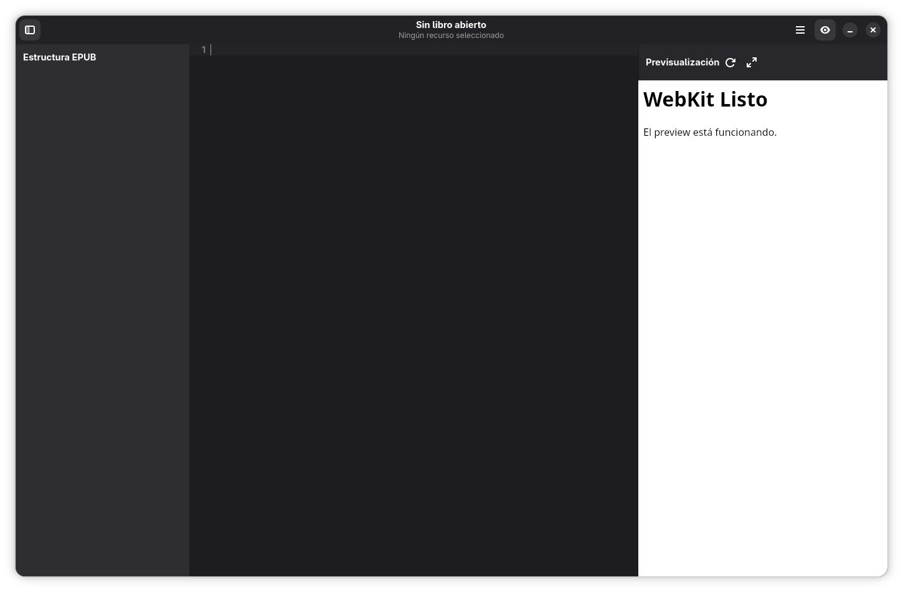

# Instalación y Primeros Pasos

## ¿Qué es GutenAI?
GutenAI es un editor modular de libros EPUB con interfaz GTK4/libadwaita. Permite abrir, modificar y exportar libros digitales con herramientas visuales y soporte para HTML, CSS e imágenes.

## Requisitos previos
- **Sistema**: Linux con GTK4, libadwaita y WebKit instalados (`python-gobject`, `libadwaita-1`, `libwebkit2gtk-4.0`).
- **Python**: versión 3.10+ con `pip`.
- **Dependencias**: instala `pip install -r requirements.txt` dentro de un entorno virtual (`python -m venv .venv && source .venv/bin/activate`).
- **Material de prueba**: la carpeta `libros/` incluye EPUBs de demostración.

## Instalación y primer arranque
1. Clona el repositorio y entra a la raíz.
2. Crea/activa el entorno virtual y ejecuta `pip install -r requirements.txt`.
3. Inicia la app con `python main.py` o usa `./run_gutenai.sh` (recomendado porque fuerza el intérprete del entorno).
4. Al abrirse, verás la ventana principal vacía lista para cargar un libro.

