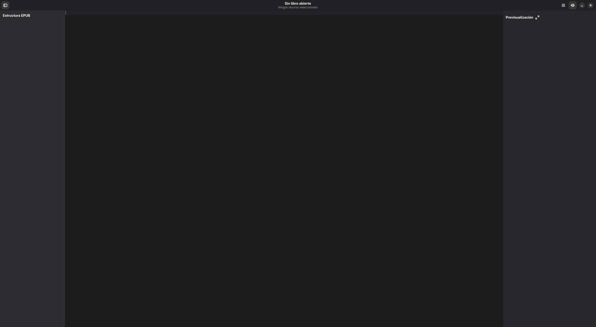

# Interfaz de Usuario

## Recorrido por la interfaz
1. **Barra superior**: muestra el nombre del libro, acciones rápidas y menú con preferencias.
2. **Sidebar izquierda**: árbol de recursos (documentos, estilos, imágenes) sincronizado con el manifest EPUB.
3. **Editor central**: presenta el contenido seleccionado con herramientas contextualizadas (HTML, CSS o visor de imágenes).
4. **Panel derecho**: previsualización en vivo del recurso, ideal para validar estilos y maquetación.

## Atajos y trucos
- Consulta la lista completa en [Atajos de teclado](../usuario/atajos.md).
- Mantén un ojo en las notificaciones de la cabecera; advierten cuando hay recursos sin guardar.
- Para ver cómo se organiza el árbol de recursos, revisa [Estructura del EPUB](../usuario/estructura_epub.md).
